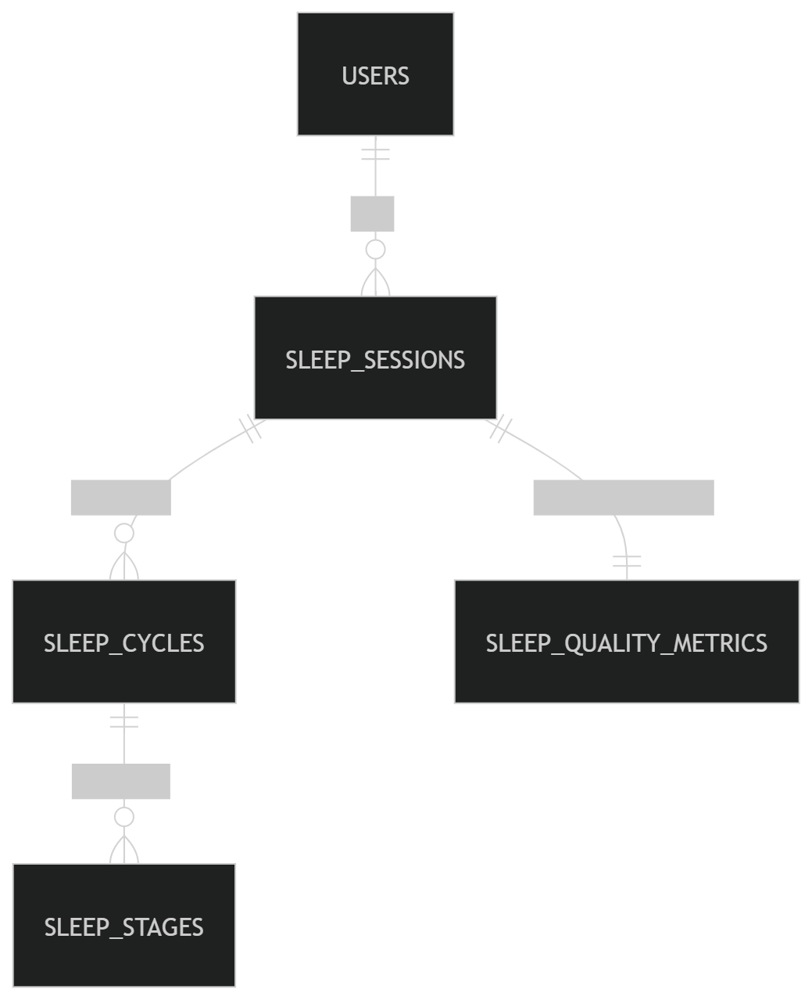

# Design Document

By Arijit Poddar

Video overview: <https://youtu.be/UEwDco54R_I>

## Scope
Sleep is one of the most critical yet least understood biological processes. While people spend nearly one-third of their lives sleeping, most are unaware of how long they sleep, how often they enter restorative stages such as REM and deep sleep, or how sleep quality varies night to night.

The purpose of this database is to systematically store, structure, and analyze sleep data in order to:

- Track nightly sleep duration and structure
- Break sleep into cycles and physiological stages
- Measure sleep quality using calculated metrics
- Enable analytical insights such as weekly REM averages, poor sleep detection, and efficiency trends

This database serves as the core data layer for a sleep tracking application focused on understanding sleep patterns rather than merely recording time asleep.
---
`In-Scope Entities`
The database includes:
- Users of the sleep tracking application
- Nightly sleep sessions per user
- Sleep cycles within each session
- Sleep stages within each cycle (REM, deep, light, awake)
- Pre-calculated sleep quality metrics per session
These components together allow for both raw data storage and analytical evaluation.
---
`Out-of-Scope Entities`
The database does not track:
- Lifestyle factors (caffeine intake, alcohol, exercise, stress)
- Medical conditions or diagnoses
- Environmental variables (noise, light, temperature)

## Functional Requirements

`Supported Capabilities`
The database enables users (or analysts) to:
- Store daily sleep data for multiple users
- Calculate sleep quality metrics such as:
    - REM percentage
    - Deep sleep percentage
    - Overall sleep score
- Generate insights including:
    - Nights with poor deep sleep
    - Number of cycles per night
    - Correlation between bedtime and sleep quality
---
`Beyond Scope`
The database is not designed to:
- Diagnose sleep disorders
- Predict health outcomes
- Store biometric sensor readings (heart rate, oxygen levels)

## Representation
The database stores information in different connected tables. Each table has a clear purpose, and they are linked together using unique IDs so the data stays organized and consistent.

### Entities
`USERS`
The `users` table stores information about each individual using the sleep tracking application.
The users table includes:
-`user_id`, which uniquely identifies each user as an `INTEGER`. This column has the `PRIMARY KEY` constraint applied and uses `AUTOINCREMENT` to automatically assign a new unique value for every user.
-`name`, which stores the user’s name as `TEXT`. The `NOT NULL` constraint ensures that every user record contains a name.
-`age`, which stores the user’s age as an `INTEGER`. Since age must be a positive numerical value, a CHECK `(age > 0)` constraint is applied.
-`gender`, which stores the user’s gender as TEXT. A CHECK constraint restricts the allowed values to predefined options `(male, female, other, prefer_not_say)` to maintain consistency.

`SLEEP_SESSIONS`
The sleep_sessions table represents one complete session of sleep for a user.
The sleep_sessions table includes:
-`session_id`, which uniquely identifies each sleep session as an `INTEGER` and serves as the `PRIMARY KEY`.
-`user_id`, which references the user who owns the sleep session as an `INTEGER`. This column has a `FOREIGN KEY` constraint linking it to users(user_id), ensuring that every sleep session belongs to a valid user.
-`sleep_date`, which stores the calendar date of the sleep session as `DATE`. This allows for time-based analysis such as weekly or monthly summaries.
-`bed_time`, which records when the user went to sleep as `DATETIME`.
-`wake_time`, which records when the user woke up as `DATETIME`.
-`total_sleep_minutes`, which stores the total time spent asleep as an `INTEGER`.

`SLEEP_CYCLES`
The `sleep_cycles` table represents the repeating sleep cycles that occur during each sleep session.
The sleep_cycles table includes:
-`cycle_id`, which uniquely identifies each sleep cycle as an `INTEGER` and serves as the `PRIMARY KEY`.
-`session_id`, which links the cycle to a specific sleep session as an `INTEGER`. This column has a `FOREIGN KEY` constraint referencing sleep_sessions(session_id), ensuring every cycle belongs to a valid session.
-`cycle_number`, which stores the order of the cycle during the night as an `INTEGER` (first cycle, second cycle, etc.).
-`start_time`, which records when the cycle began as `DATETIME`.
-`end_time`, which records when the cycle ended as `DATETIME`.
-`duration_minutes`, which stores the total length of the cycle as an `INTEGER`.

Humans typically go through multiple sleep cycles per night. Storing cycles explicitly enables detailed cycle-level analysis and accurate mapping of sleep stages within each cycle.

`SLEEP_STAGES`
The `sleep_stages` table represents the physiological sleep phases occurring inside each sleep cycle.
The sleep_stages table includes:
-`stage_id`, which uniquely identifies each sleep stage entry as an `INTEGER` and serves as the `PRIMARY KEY`.
-`cycle_id`, which links the stage to a specific sleep cycle as an `INTEGER`. This column uses a `FOREIGN KEY` constraint referencing sleep_cycles(cycle_id) to preserve hierarchical integrity.
-`stage_type`, which stores the type of sleep stage as `TEXT`. A CHECK constraint limits values to `REM, DEEP, LIGHT, and AWAKE` to ensure standardized classification.
-`start_time`, which records when the stage began as `DATETIME`.
-`end_time`, which records when the stage ended as `DATETIME`.
-`duration_minutes`, which stores how long the stage lasted as an `INTEGER`.

Sleep stages represents physiological sleep phases inside each cycle. Types:
- REM (Rapid Eye Movement):Associated with dreaming, memory consolidation, emotional processing
- DEEP (Slow-wave sleep):Physical recovery, muscle repair, immune support
- LIGHT:Transitional sleep, easier to wake
- AWAKE:Brief disruptions or waking periods

`SLEEP_QUALITY_METRICS`
The `sleep_quality_metrics` table stores calculated summary values for each sleep session.
The sleep_quality_metrics table includes:
-`metric_id`, which uniquely identifies each metrics record as an `INTEGER` and serves as the `PRIMARY KEY`.
-`session_id`, which links the metrics to a specific sleep session as an `INTEGER`. A `FOREIGN KEY` constraint ensures that metrics correspond to a valid session.
-`rem_percentage`, which stores the percentage of total sleep spent in REM sleep as a `REAL`.
-`deep_percentage`, which stores the percentage of total sleep spent in deep sleep as a `REAL`.
-`sleep_score`, which stores an overall sleep quality score as a `REAL`, typically scaled between `0 and 100` for intuitive interpretation.

These calculated fields simplify reporting and improve performance by avoiding repeated aggregation queries.

### Relationships
The below entity relationship diagram describes the relationships among the entities in the database.

As detailed by the diagram:
-One user can have 0 to many sleep sessions. A sleep session belongs to one and only one user.
-One sleep session has 1 to many sleep cycles. Each sleep cycle belongs to one and only one sleep session.
-One sleep cycle has 1 to many sleep stages. Each sleep stage belongs to one and only one sleep cycle.
-One sleep session has exactly one sleep quality metrics record. Each sleep quality metrics record corresponds to one and only one sleep session.

## Optimizations
`Speed up queries filtering sessions by user`
CREATE INDEX idx_sleep_sessions_user_id
ON sleep_sessions(user_id);

`Speed up queries retrieving cycles within a session`
CREATE INDEX idx_sleep_cycles_session_id
ON sleep_cycles(session_id);

`Speed up queries retrieving stages within a cycle`
CREATE INDEX idx_sleep_stages_cycle_id
ON sleep_stages(cycle_id);

## Limitations
- Sleep score model is simplified
- No sensor-level biometric data
- Does not capture naps or fragmented sleep days
